# 🚀 DataDrop — AWS 3-Tier Web Application

<p align="center">
  <b>A production-style, cloud-deployed full-stack app on AWS</b><br>
  Custom VPC · Public/Private Subnet Isolation · HTTPS · Custom Domain
</p>

<p align="center">
  
  
  
  
  
  
</p>

<p align="center">
  🌐 <b>Live:</b> <a href="https://sarafaysal.site">sarafaysal.site</a>
</p>

---

## 📖 What is this?

A simple textbox-and-Insert-button app — but the real project is everything running *underneath* it. Text typed in the React frontend travels through a Flask backend (which timestamps it) into a PostgreSQL database — all deployed across an isolated AWS network with only the frontend exposed to the public internet.

This was built as a hands-on cloud infrastructure project to learn: VPC networking, subnet isolation, security groups, SSH bastion access, reverse proxying, systemd service management, and DNS/SSL setup — end to end, from a completely cold start.

---

## 🏗️ Architecture

```
                              Internet
                                 |
                                 v
                sarafaysal.site  (Namecheap -> Route 53 DNS)
                                 |
                                 v
+-------------------------- VPC: myapp-vpc-vpc --------------------------+
|                                                                        |
|   PUBLIC SUBNET  (eu-north-1a / eu-north-1b)                          |
|   +----------------------------------+                                |
|   |  frontend-server                 |  <- only publicly reachable    |
|   |  - React app (built)             |     machine                   |
|   |  - Nginx (serves app +           |                                |
|   |    reverse-proxies /api/)        |                                |
|   |  - Let's Encrypt SSL (HTTPS)     |                                |
|   +----------------+-----------------+                                |
|                    | SSH jump + private API calls                     |
|   PRIVATE SUBNET  (eu-north-1a)                                       |
|   +----------------v-----------------+      +----------------------+ |
|   |  backend-server                  |----->|  database-server     | |
|   |  - Flask REST API                |      |  - PostgreSQL        | |
|   |  - Runs as systemd service       |      |  - No public IP      | |
|   |    (auto-restart, boots on start)|      |  - Reachable only    | |
|   |  - No public IP                  |      |    from backend-sg   | |
|   |                                   |      |    on port 5432      | |
|   +-----------------------------------+      +----------------------+ |
|                                                                        |
+------------------------------------------------------------------------+
```

**🔐 Access model:** Only `frontend-server` is internet-facing. `backend-server` and `database-server` live in a private subnet with **zero public exposure** — reachable only via SSH-jump through the frontend (for management) or scoped Security Group rules (for app traffic).

---

## 🧰 Tech Stack

| Layer | Tool |
|---|---|
| 🎨 Frontend | React (Vite) |
| ⚙️ Backend | Python + Flask |
| 🗄️ Database | PostgreSQL |
| 🔀 Reverse Proxy | Nginx |
| 🔒 SSL/TLS | Certbot (Let's Encrypt) |
| ☁️ Cloud | AWS (EC2, VPC, Route 53) |
| 🌐 Domain Registrar | Namecheap |
| 🐧 OS | Ubuntu Server 24.04 LTS |
| ♻️ Process Manager | systemd |

---

## 🔒 Networking & Security

| Component | Role |
|---|---|
| **VPC** `myapp-vpc-vpc` | Isolated private network for all 3 machines |
| **Public subnets** (1a, 1b) | Host `frontend-server`; internet-reachable |
| **Private subnet** (1a) | Hosts `backend-server` + `database-server`; not internet-reachable |
| **Internet Gateway** | Public subnet ↔ internet |
| **NAT Gateway** | Lets private-subnet machines reach the internet outbound (updates, installs) without being reachable inbound |

**🛡️ Security Group rules:**

| Security Group | Inbound Rules |
|---|---|
| `frontend-sg` | SSH (22) from my IP · HTTP (80) + HTTPS (443) from anywhere |
| `backend-sg` | Custom TCP (5000) from `frontend-sg` only · SSH (22) from `frontend-sg` |
| `database-sg` | PostgreSQL (5432) from `backend-sg` only · SSH (22) from `frontend-sg` |

> Nothing is exposed except the frontend. The database only trusts the backend; the backend only trusts the frontend.

---

## 🌐 Domain & HTTPS

- Domain **`sarafaysal.site`** registered on **Namecheap**
- DNS delegated to **AWS Route 53** (nameservers pointed from Namecheap → Route 53)
- Route 53 A record → frontend's public IP
- **Nginx** serves the built React app + reverse-proxies `/api/` → backend's private IP
- **Certbot** (Let's Encrypt) issues a free SSL certificate directly on the frontend instance
- Both HTTP and HTTPS respond independently — no forced redirect

---

## ♻️ Backend Persistence

The Flask backend runs as a **systemd service** (`myapp-backend.service`):
- ✅ Starts automatically on instance boot
- ✅ Auto-restarts on crash
- ✅ Runs independent of any active SSH session

---

## 📸 Screenshots

### ☁️ AWS Infrastructure

**EC2 Instances — all 3 running**
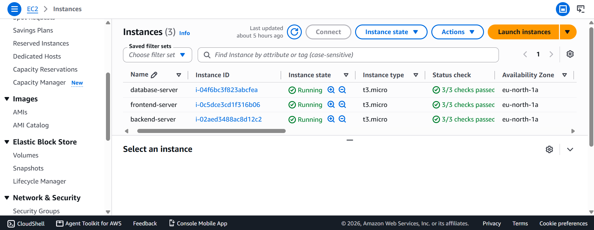

**VPC Resource Map**
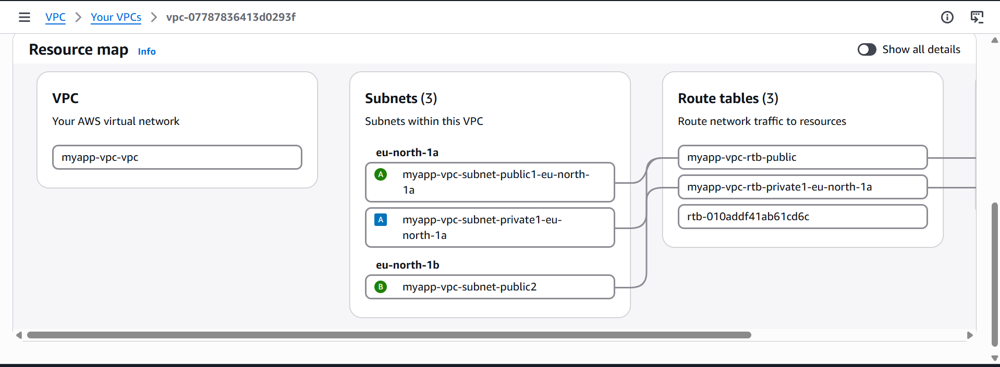
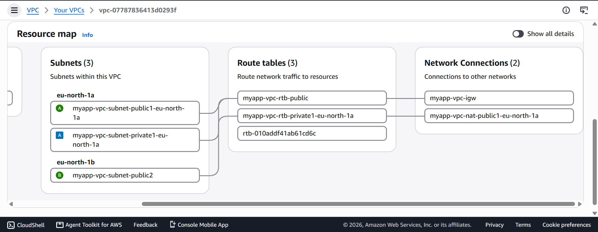

**Subnets — Public + Private**
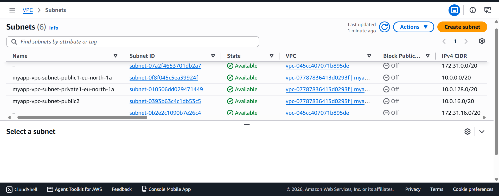

**Security Group — Frontend**
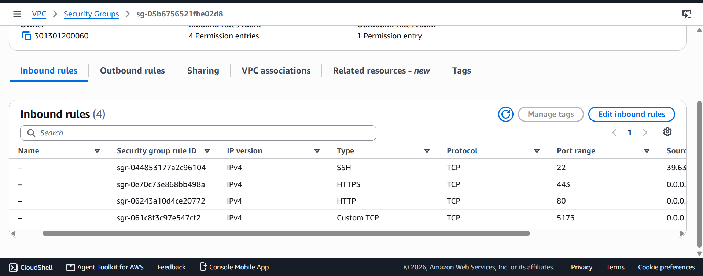

**Security Group — Backend**
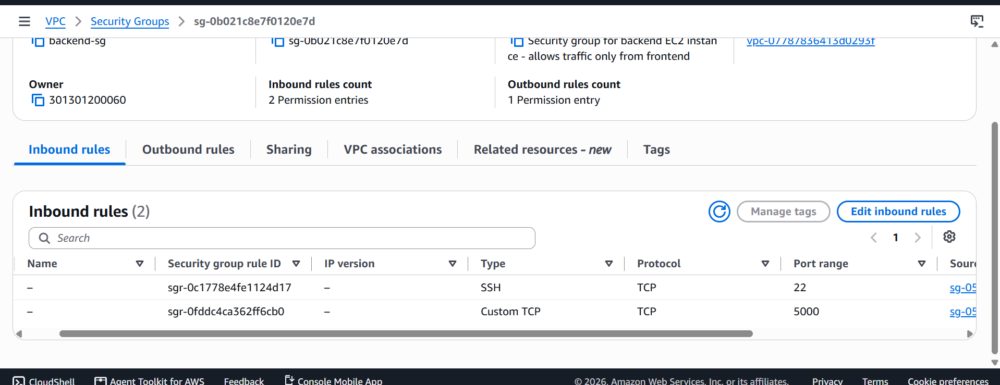

**Security Group — Database**
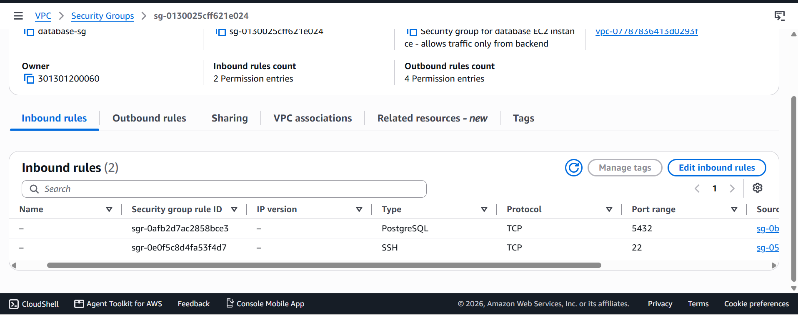

### ✅ Application Verification

**Database — stored entries confirmed**
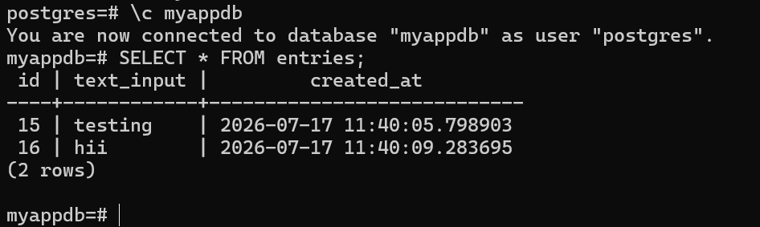

**Backend — manual API test**
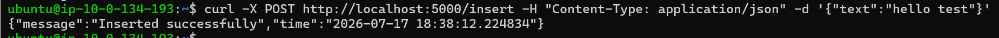

**Backend — running as a persistent systemd service**
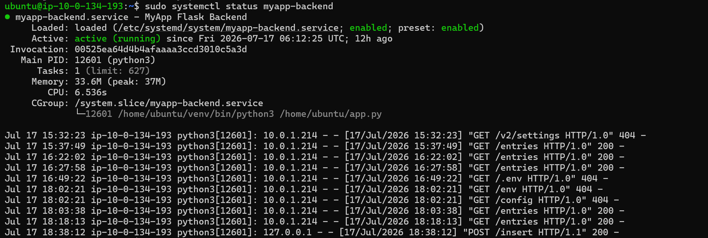

**Nginx — HTTP + HTTPS both responding**
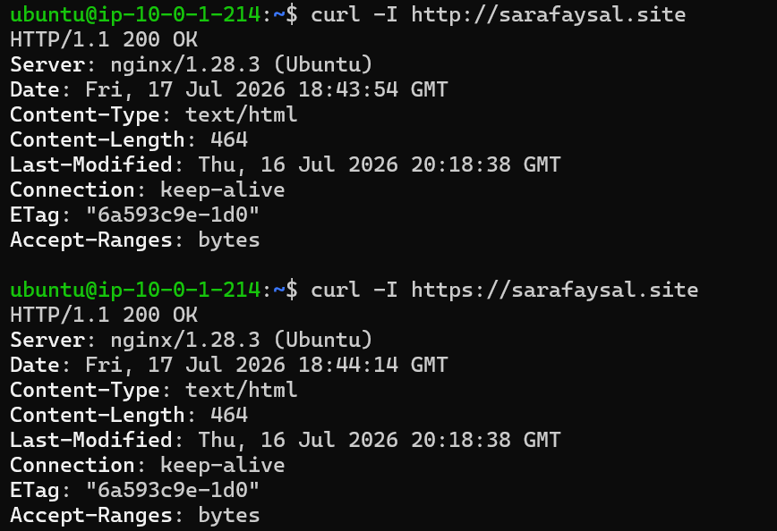

**SSL Certificate — valid, issued by Let's Encrypt**
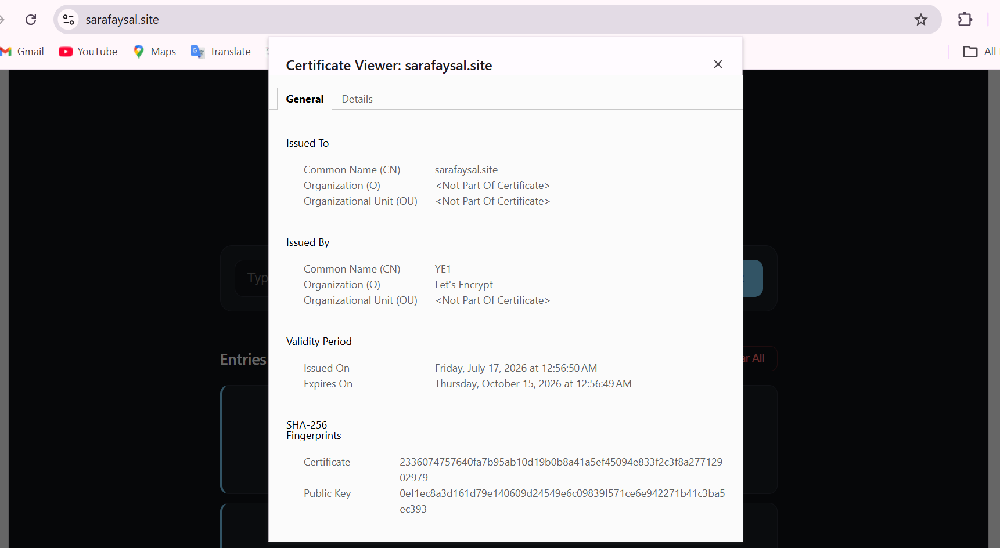

**Live application**
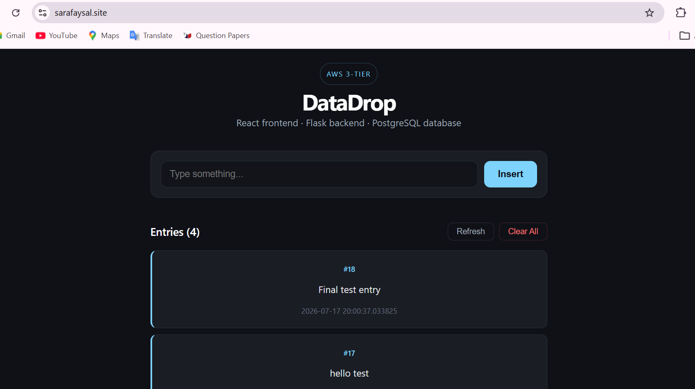

### 🌐 Domain / DNS

**Route 53 — Hosted Zone records**
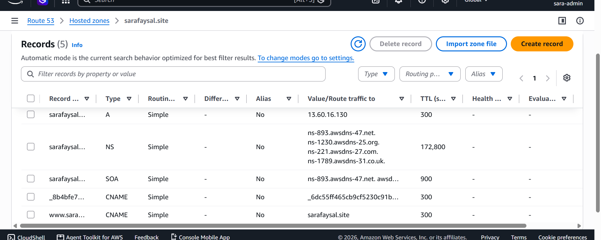

**Namecheap — nameservers pointed to Route 53**
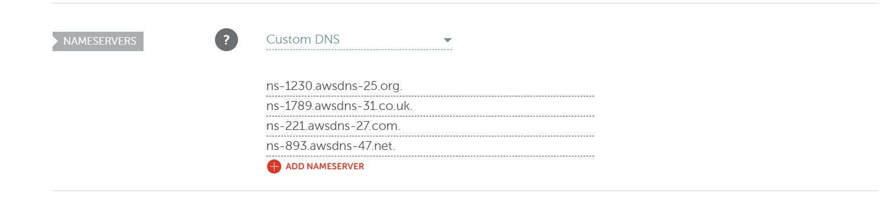

### 🔁 End-to-End Proof

Typed a unique entry on the live site → immediately queried the database → same entry confirmed present with matching timestamp.

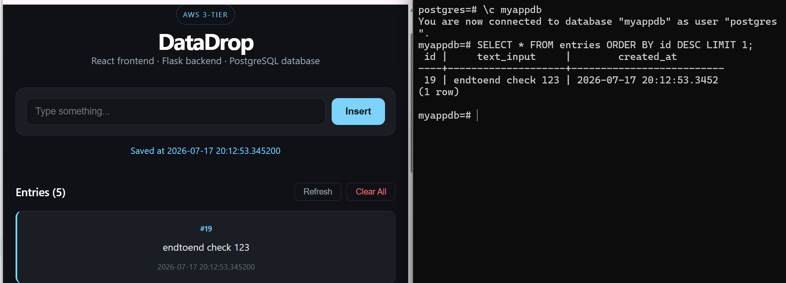

---

## 📝 Notes & Design Decisions

- Originally planned to use an **AWS Application Load Balancer + AWS Certificate Manager** for HTTPS. Switched to **Nginx + Certbot** directly on the frontend instance — simpler for this scale, and an equally valid real-world pattern.
- All 3 EC2 instances run on **Free Tier eligible** types (`t2.micro` / `t3.micro`).
- SSH access to private-subnet machines is achieved via a **bastion/jump pattern**: laptop → frontend (public) → backend/database (private), reusing one key pair across all machines.

---

## 🎓 What I Learned

- Designing a VPC with public/private subnet separation
- Using Security Groups as scoped, group-to-group firewalls instead of open IP rules
- SSH bastion/jump-host access patterns for private infrastructure
- Reverse proxying with Nginx and issuing free SSL certs via Certbot
- Running backend services reliably with systemd
- Connecting a registrar (Namecheap) to a DNS service (Route 53) via nameserver delegation

---

<p align="center">Built as a hands-on AWS infrastructure learning project 🌱</p>
